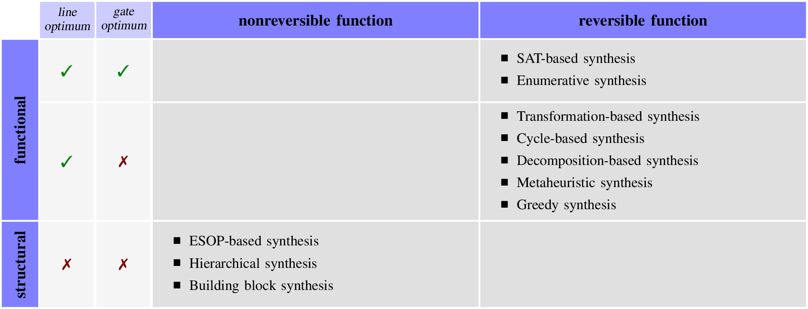
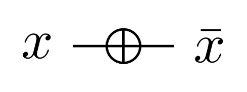
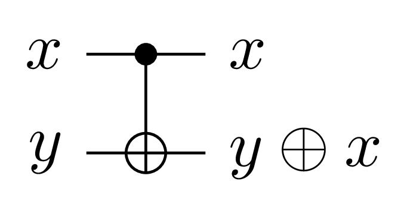
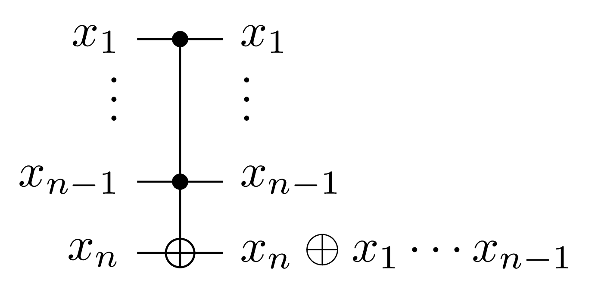
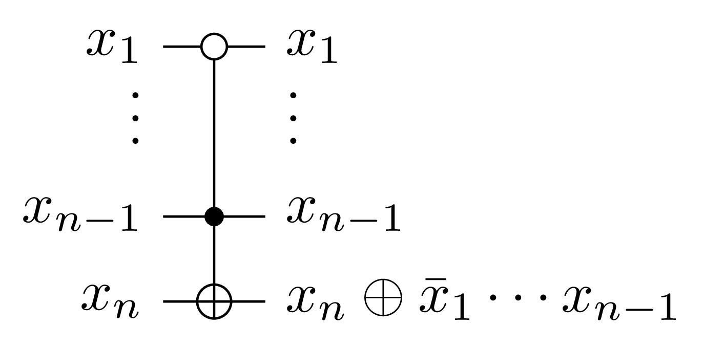
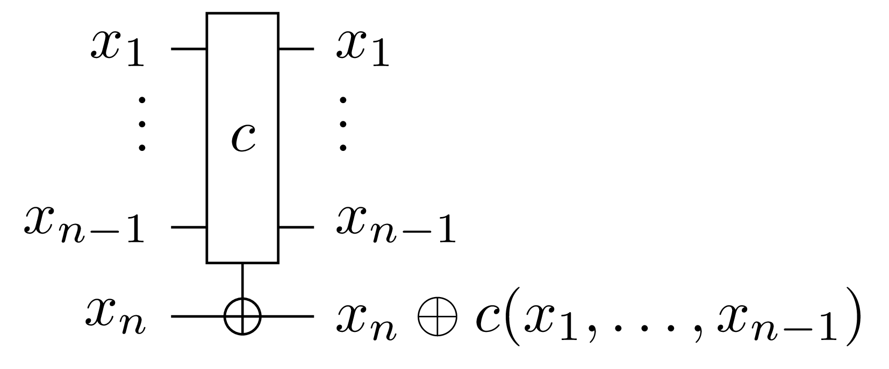

# State-of-the-art in reversible logic synthesis

#### Table of Contents

- [Overview](#overview)
- [Gate libraries](#gate-libraries)
	- [NCT (Not, CNOT, Toffoli)](#nct-not-cnot-toffoli)
	- [MCT (Multiple-controlled Toffoli gates)](#mct-multiple-controlled-toffoli-gates)
	- [MPMCT (Mixed-polarity Multiple-controlled Toffoli gates)](#mpmct-mixed-polarity-multiple-controlled-toffoli-gates)
	- [STG (Single-target gates)](#stg-single-target-gates)
- [Embedding](#embedding)
- [Synthesis algorithms for reversible functions](#synthesis-algorithms-for-reversible-functions)
	- [Functional exact algorithms](#functional-exact-algorithms)
		- [SAT-based synthesis](#sat-based-synthesis)
		- [Enumerative synthesis](#enumerative-synthesis)
	- [Functional heuristic algorithms](#functional-heuristic-algorithms)
		- [Transformation-based synthesis](#transformation-based-synthesis)
		- [Decomposition-based synthesis](#decomposition-based-synthesis)
		- [Metehauristic synthesis](#metaheuristic-synthesis)
		- [Greedy synthesis](#greedy-synthesis)
- [Synthesis algorithms for nonreversible functions](#synthesis-algorithms-for-nonreversible-functions)
	- [Structural algorithms](#structural-algorithms)
		- [ESOP-based synthesis](#esop-based-synthesis)
		- [Hierarchical synthesis](#hierarchical-synthesis)
		- [Building block synthesis](#building-block-synthesis)
- [Historical remarks](#historical-remarks)

## Overview

We classify reversible synthesis algorithms using 4 levels of categorization:

1. **Reversibility of the input**: we distinguish between nonreversible and reversible functions.  Embedding is not part of this categorization and need to be applied as a preprocess if needed. Columns in the overview figure refer to this level.
2. **Manipulation of the input**: if the synthesis algorithm modifies the input during execution or emphasizes on the underlying function of the input rather than its structure, we refer to the synthesis approaches as *functional synthesis*, otherwise as *structural synthesis*.  Functional synthesis algorithms guarantee optimum lines during synthesis and may also allow optimum number of gates. Rows in the overview figure refer to this level.
3. **Algorithm**: For each category several algorithms may be proposed which differ in their conceptual methodology. Items in boxes refer to this level.
4. **Implementation**: Each algorithm can be implemented in several different ways using several different data structures for the input representation.  This level is not visible in the overview figure but discussed in the following text.

**Example**: The original transformation-based synthesis algorithm from D.M. Miller, D. Maslov and G.W. Dueck [[*DAC* **40**, 2003, 318-323.]](http://dl.acm.org/citation.cfm?doid=775832.775915) starts from a *reversible input function* (1) and it is *functional* (2).  Obviously, it falls in the category of *transformation-based synthesis* algorithms (3) and the specific works marks one of many implementations in this category (4).

## Gate libraries

### NCT (Not, CNOT, Toffoli)

| NOT                  | CNOT                   | Toffoli                      |
| -------------------- | ---------------------- | ---------------------------- |
|  |  |  |

The NCT library consists of the three gates NOT, CNOT, and Toffoli.  The Toffoli gate is a double-controlled NOT gate. These gates are universal in a sense, that every Boolean function can be realized if an arbitrary number of variables (lines) is permitted.  Given *n* variables, the NCT gate library can realize all permutations over *n* ≤ 3 variables and all even permutations over *n* > 3 variables.

### MCT (Multiple-controlled Toffoli gates)

| MCT                  |
| -------------------- |
|  |

The MCT library consist of  NOT, CNOT, Toffoli, and multi-controlled NOT gates.  An MCT gate with *n* variables has *(n-1)* controls and one target. Each of the control line values pass through the gate unaltered while the target line value is inverted if all the control lines are set to 1.

### MPMCT (Mixed-polarity Multiple-controlled Toffoli gates)

| MPMCT                  |
| -------------------- |
|  |

The MPMCT library is more general than the MCT library. The controls of the MPMCT gates cannot only have positive polarity but also negative polarity. In this case, the target line value is inverted if all the positive control lines are set to 1 and all the negative control lines are set to 0.

### STG (Single-target gates)

| Single-target-gate   |
| -------------------- |
|  |

Given *n* variables, a single-target gate (ST) has a control function *c* instead of control variables. The control function is a Boolean function with *(n-1)* inputs and one output. The target line is inverted if and only if *C* evaluates to true. All other variables remain unchanged.  The target line cannot be in the support of *c*.

## Embedding
**TODO**

## Synthesis algorithms for reversible functions

### Functional exact algorithms
Exact synthesis algorithms guarantee minimality in number of gates (time) and number of lines (space).

#### SAT-based synthesis
Given a truth table of a Boolean function *f*, the decision problem “*Does there exist a reversible circuit with k gates that represents f?*” is translated into a SAT problem. A circuit can be extracted from a satisfying assignment to the problem. Asking the question, starting from *k* being 0 and incrementing it until the problem is satisfiable, gives the gate-optimum circuit.

**Input representations:** truth table

**Gate libraries:** MCT, MPMCT

**Implementations:** [RevKit](https://github.com/msoeken/cirkit/blob/master/addons/cirkit-addon-reversible/src/reversible/synthesis/exact_synthesis.cpp) (command: `exs --mode 1`), [RevKit](https://github.com/msoeken/cirkit/blob/master/addons/cirkit-addon-reversible/src/reversible/synthesis/quantified_exact_synthesis.cpp) (command: `exs --mode 0`)

**References:**
* [D. Große, R. Wille, G.W. Dueck, and R. Drechsler: Exact multiple-control Toffoli network synthesis with SAT techniques, in: *IEEE Trans. on CAD* **28**, 2009, 703&ndash;715.](http://dx.doi.org/10.1109/TCAD.2009.2017215)  

  This paper presented exact synthesis algorithms that find the MCT circuit with the minimal number of gates for a given reversible function. The introduced algorithms formulate the synthesis problem as a sequence of decision problems. The decision problems are encoded as Boolean satisfiability (SAT) or SAT modulo theory (SMT) instances. 

* [R. Wille, H.M. Le, G.W. Dueck, and D. Große: Quantified synthesis of reversible logic, in: *DATE*, 2008, 1015-1020.](http://dx.doi.org/10.1109/DATE.2008.4484814)

  This paper uses BDDs to encode the decision problem.  Consequently, it allows to represent all solutions to the problem and not just only a single one.  The best solution can be selected with respect to some secondary cost criteria.

* [R. Wille, M. Soeken, N. Przigoda, and R. Drechsler: Effect of negative control lines on the exact synthesis of reversible circuits, in: *Multiple-valued Logic and Soft Computing* **21**, 2013, 627-640.](http://www.oldcitypublishing.com/MVLSC/MVLSCabstracts/MVLSC21.5-6abstracts/MVLSCv21n5-6p627-640Wille.html)

  This paper extended the scope of exact synthesis algorithms by considering MPMCT gates in the synthesis problem.

#### Enumerative synthesis
Due to the use of a precomputed database of all gate-optimal 4-input reversible circuits up to 8 or 9 gates, generated by exhaustive calculations, it is possible to develop a tool for gate-optimal synthesis of any 4- variable reversible function (4-input gate-optimal circuits require at most 15 gates). In a similar way a tool for reducing quantum cost of 4-input reversible circuits can be developed. Such tools has been implemented and also used for constructing provably gate-optimal reversible circuits of any number of inputs by extrapolating properties of 3-input and 4-input optimal circuits.

**Input representations:** truth table

**Gate libraries:** MCT, MPMCT

**References:**
* [A.K. Prasad, V.V. Shende, K.N. Patel, I.L. Markov, and J.P. Hayes: Data structures and algorithms for simplifying reversible circuits, in: *ACM JTEC* **2**, 2006, 277-293.](http://dl.acm.org/citation.cfm?id=1216399)

  This paper presents an algorithm that generates a library of optimal realizations for small NCT reversible circuits. This library is used afterwards to synthesize optimal circuits for all 3-bit reversible functions, and millions of 4-bit circuits.

* [O. Golubitsky, S.M. Falconer, and D. Maslov: Synthesis of the optimal 4-bit reversible circuits, in DAC 47, 2010, 653-656.]()

  This paper presented the first tool capable of synthesizing a gate-optimal reversible circuit for any of the 16! reversible functions of 4 variables. The main idea behind this tool is to use hash tables to store a compact representation of the reversible functions for the optimal circuits up to 9 gates which fit into the resources available in nowadays computers. Then, by exhaustive combining the information about the circuits up to *n* gates, one can construct the optimal circuit for the function requiring up to 2*n* gates.

* [O. Golubitsky and D. Maslov: A study of optimal 4-Bit reversible Toffoli circuits and their synthesis, in: *IEEE Trans. Computers* **61**, 2012, 1341-1353.](http://dx.doi.org/10.1109/TC.2011.144)

  In this paper by exhaustive calculations of gate-optimal reversible circuits for all 16! reversible functions of 4 variables (lasting approximately for 13 days) it was possible to establish that there are only 144 4-bit functions requiring 15 gates in their optimal circuits and that there exists none requiring 16 or more gates.

* [M. Szyprowski and P. Kerntopf: Reducing quantum cost in reversible Toffoli circuits, in: *RM* **9**, 2011, 127-136.]()

* [M. Szyprowski and P. Kerntopf: An approach to quantum cost optimization in reversible circuits, in: *IEEE-NANO*, **11**, 2011, 1521-1526.]()

  The above two papers presented an approach to reducing quantum cost in reversible circuits which is similar to the one in [O. Golubitsky and D. Maslov, *DAC* **47**, 2010]. However, it was based on finding *all* circuits implementing a given 4*4 reversible function with a specified value of gate count. Quantum cost of the constructed circuits for the set of reversible benchmarks was on average over 50% lower than the quantum cost of the circuits previously published in the literature. The approach is general enough to allow for quantum cost reduction in reversible circuits built from any reversible gate library.

* [M. Szyprowski and P. Kerntopf: Optimal 4-bit reversible mixed-polarity Toffoli circuits, in *RC* **4**, 2012, 138-151.](http://dx.doi.org/10.1007/978-3-642-36315-3_11)

  This paper presents a method for constructing 4-input reversible MPMCT circuits with reduced quantum cost.

* [Z. Li, H. Chen, X. Song, and M. Perkowski: A synthesis algorithm for 4-bit reversible logic circuits with minimum quantum cost, in: *JETC* **11**, 2014, 29:1-29:19.]()

  This paper presents an improvement over M. Szyprowski and P. Kerntopf [*RM* **9**, 2011] with respect to synthesizing 4-input reversible circuits with reduced quantum cost.

* [J. Jegier, P. Kerntopf, and M. Szyprowski: An approach to constructing reversible multi-qubit benchmarks with provably minimal implementations, in: *IEEE-NANO* **13**, 2013, 99-104.]()

* [J. Jegier and P. Kerntopf: Progress towards constructing sequences of benchmarks for quantum Boolean circuits synthesis, in: *IEEE-NANO* **14**, 2014, 250-255.]()

* [J. Jegier and P. Kerntopf: Gate count minimal reversible circuits for two infinite sequences of self-inverse functions, in: *IWBP* **11**, 2014, 115-122.]()

* [J. Jegier and P. Kerntopf: Gate count minimal reversible circuits, in: *Problems and New Solutions in the Boolean Domain*, Bernd Steinbach (ed.), Cambridge Scholars Publishing, 2016, 342-355.]()

  The above four papers present the first approaches to constructing sequences of reversible functions of any number of variables for which gate-optimal circuits without additional lines have been found. The main result consists in proving their gate-minimality. Constructing the sequences was done by extrapolating circuits selected from the database as in M. Szyprowski and P. Kerntopf [*RM* **9**, 2011, *IEEE-NANO* **11**, 2011].

### Functional heuristic algorithms
Functional heuristic synthesis algorithms guarantee minimality in number of lines (space).

#### Transformation-based synthesis
Starting from a reversible function, transformation-based synthesis applies gates and adjusts the function representation accordingly in a way that each gate application gets the function closer to the identity function.  If the identity function has been reached, all applied gates make up for the circuit that realizes the initial function.

**Input representations:** truth table, RCBDD

**Gate libraries:** MCT, MPMCT (only negative controls), MCT+F

**Implementations:** [RevKit](https://github.com/msoeken/cirkit/blob/master/addons/cirkit-addon-reversible/src/reversible/synthesis/transformation_based_synthesis.cpp) (command: `tbs`), [RevKit](https://github.com/msoeken/cirkit/blob/master/addons/cirkit-addon-reversible/src/reversible/synthesis/symbolic_transformation_based_synthesis.cpp) (command: `tbs -b` and `tbs -s`)

**References:**
* [D.M. Miller, D. Maslov, and G.W. Dueck: A transformation based algorithm for reversible logic synthesis, in: *DAC* **40**, 2003, 318-323.](http://dl.acm.org/citation.cfm?doid=775832.775915)

  This paper first introduced the transformation based synthesis algorithm.  It descibes first the basic unidirectional version but also the bidirectional variant which often results in circuits of smaller size.
  
* [D. Maslov, G.W. Dueck, and D.M. Miller: Toffoli network synthesis with templates, in: *IEEE Trans. on CAD of Integrated Circuits and Systems* **24**, 2005, 807-817.](http://dx.doi.org/10.1109/TCAD.2005.847911)

  This paper extends the transformation based synthesis algorithm by applying a heuristic approach to optimize the generated circuits. The major enhancement to the basic algorithm is using a template simplification tool, a tool which allows further reduction of the networks produced by the synthesis algorithm. A templates is a circuit of gates that realizes the identity function.

* [D. Maslov, G.W. Dueck, and D.M. Miller: Synthesis of Fredkin-Toffoli reversible networks, in: *IEEE Trans. VLSI Syst.* **13**, 2005, 765-769.](http://dx.doi.org/10.1109/TVLSI.2005.844284)

  This paper presents a new variant of the transformation based synthesis that uses not only MCT gates but also Fredkin gates for generating reversible circuits.

* [M. Soeken, R. Wille, C. Hilken, N. Przigoda, and R. Drechsler: Synthesis of reversible circuits with minimal lines for large functions, in: *ASP-DAC* **17**, 2012, 85-92.](http://dx.doi.org/10.1109/ASPDAC.2012.6165069)

  This paper presents a solution to the scalability limitation of the transformation based reversible logic synthesis algorithm for constructing ancilla-free reversible circuits. The introduced algorithm used Quantum Multiple-valued Decision Diagrams (QMDDs) to represent reversible functions which enables the automatic synthesis of large functions with the minimal number of circuit lines.

* [M. Soeken, G.W. Dueck, and D.M. Miller: A fast symbolic transformation based algorithm for reversible logic synthesis, in: *RC* **8**, 2016.](http://msoeken.github.io/papers/2016_rc_1.pdf)

  This paper presents a symbolic variant of the transformation based synthesis approach for reversible logic. The approach allows the realization of larger reversible functions without additional ancilla lines. It exploits a property considering the ordering in which assignments need to be considered for adjustment. Both a BDD and a SAT based implementation of the symbolic synthesis algorithm have been presented.
  
* [M. Soeken and A. Chattopadhyay: Fredkin-enabled transformation-based reversible logic synthesis, in: *ISMVL* **46**, 2015, 60-65.](http://ieeexplore.ieee.org/xpl/articleDetails.jsp?arnumber=7238133)

  This paper presents an extension to the transformation based synthesis algorithm that exploits Fredkin gates.  By employing a look-ahead technique, more Fredkin gates can be added to the circuit overall leading in smaller gate count.

#### Decomposition-based synthesis
In decomposition-based synthesis the reversible function is iteratively decomposed into simpler functions based on the  *Young subgroup decomposition*: Given a line *i*, every reversible function *f* can be decomposed into three functions *f = g1* ○ *f'* ○ *g2*, where *g1* and *g2* can be realized with a single-target gate on line *i* and *f'* is a reversible function that does not change in line *i*. Based on this decomposition, synthesis algorithms determine the gates for *g1* and *g2* and then recur on *f'*.

**Input representations:** truth table, RCBDD

**Gate libraries:** STG

**Implementations:** [RevKit](https://github.com/msoeken/cirkit/blob/master/addons/cirkit-addon-reversible/src/reversible/synthesis/young_subgroup_synthesis.cpp) (command: `dbs`), [RevKit](https://github.com/msoeken/cirkit/blob/master/addons/cirkit-addon-reversible/src/reversible/synthesis/rcbdd_synthesis.cpp) (command: `dbs -s`)

**References:**
* [A. De Vos and Y. Van Rentergem: Young subgroups for reversible computers, in: *Adv. in Math. of Comm.* **2**, 2008, 183-200.](http://dx.doi.org/10.3934/amc.2008.2.183)

  This paper introduced the theoretical background for decomposition-based synthesis and proved the main decomposition rule explained above. The proofs involve Young subgroups, however, the synthesis algorithm derived from it, is quite straightforward.  It computes new truth tables for each single-target gate in the circuit in a way that the propery of the decomposition is uphold. 

* [M. Soeken, L. Tague, G.W. Dueck, and R. Drechsler: Ancilla-free synthesis of large reversible functions using binary decision diagrams, in: *J. Symb. Comput.* **73**, 2016, 1-26.](http://dx.doi.org/10.1016/j.jsc.2015.03.002)

  This paper proposes a symbolic variant of the truth table based variant introduced by De Vos and Van Rentergem.  It works on the binary decision diagram representation of the reversible function. The paper also introduces how simple algebraric operations can be performed on the BDD representation of reversible functions, e.g., gate composition or reversibility checking.

#### Metaheuristic synthesis
Synthesis in these category synthesize a circuit based on a metaheuristic such as genetic algorithms, genetic programming, ant colony optimization, or particle swarm optimization.

**Input representation:** truth table

**Gate libraries:** MCT, MCT+P (in principle, any functionally complete set of gates may be used)

**References:**
* [F.Z. Hadjam and C. Moraga: RIMEP2: Evolutionary design of reversible digital circuits, in *JETC* **11**, 2014, 27:1-27:23.](http://dl.acm.org/citation.cfm?doid=2629534)

  This paper gives a detailed description of a method to design reversible circuits using genetic programming. The method does not require a supporting database of circuits: circuits are evolved from scratch.  Reported circuits are among the best in the prevailing literature.

* [X. Wang, L. Jiao, Y. Li, Y. Qi, and Jianshe Wu: A variable-length chromosome evolutionary algorithm for reversible circuit synthesis, in: *Multiple-Valued Logic and Soft Computing* **25**, 2015, 643-671.](http://www.oldcitypublishing.com/journals/mvlsc-home/mvlsc-issue-contents/mvlsc-volume-25-number-6-2015/mvlsc-25-6-p-643-671/)

  This paper introduces a variation of a genetic algorithm, where the length of the chromosomes is adaptive. The method also uses a database as in Golubitsky-Maslov *IEEE Tr. Comp.* **61** (see enumerative synthesis). Reported circuits are among the best in the prevailing literature.

* [P. Manna, D.K. Kole, H. Rahaman, D.K. Das, and B.B. Bhattacharya: Reversible logic circuit synthesis using genetic algorithm and particle swarm optimization, in: *ISED* **3**, 2012, 246-250.](http://ieeexplore.ieee.org/xpl/login.jsp?tp=&arnumber=6526593&url=http%3A%2F%2Fieeexplore.ieee.org%2Fxpls%2Fabs_all.jsp%3Farnumber%3D6526593)
  
  This paper introduces a hybrid combination of genetic algorithms and particle swarm optimization for the synthesis of reversible circuits.

#### Greedy synthesis
Greedy synthesis is similar to transformation-based synthesis.  At each step it applies a set of gates to the current function to be synthesized and chooses the gate that brings the function closest to the identity function.

**Input representation:** BDD

**Gate libraries:** arbitrary

**References:**
* [P. Kerntopf: A new heuristic algorithm for reversible logic synthesis, in: *DAC* **41**, 2004, 834-837.](http://dl.acm.org/citation.cfm?id=996789)

  This paper proposes an incremental approach to reversible logic synthesis using shared binary decision diagrams (SBDD) for the representation of reversible functions and for measuring their complexity.

## Synthesis algorithms for nonreversible functions

### Structural algorithms
Structural algorithms do neither guarantee optimality for number of gates nor for number of lines.

#### ESOP-based synthesis
An ESOP expression of a function *f* is an exclusive sum of products.  Given an ESOP expression of a function, it can easily be translated into a cascade of Toffoli gates by adding one additional circuit line to store the result. This line is initialized with 0 and for each product term in the ESOP expression a MPMCT gate is added with controls according to the produc term and a target on the additional line. If MCT circuits are targeted, negative controls can be realized using NOT gates. In this case, the aim is to minimize the number of NOT gates.

**Gate libraries:** MCT, MPMCT

**Implementations:** [RevKit](https://github.com/msoeken/cirkit/blob/master/addons/cirkit-addon-reversible/src/reversible/synthesis/esop_synthesis.cpp) (command: `esopbs`)

**References:**
- [K. Fazel, M.A. Thornton, and J.E. Rice: ESOP-based Toffoli gate cascade generation, in: *PACRIM*, 2007, 206-209.](http://citeseerx.ist.psu.edu/viewdoc/download?doi=10.1.1.79.2392&rep=rep1&type=pdf)

  This paper introduces the idea of ESOP-based reversible logic synthesis.

- [R. Drechsler, A. Finder, and R. Wille: Improving ESOP-based synthesis of reversible logic using evolutionary algorithms, in: *EvoApplications*, 2011, 151-161.](http://dx.doi.org/10.1109/ETS.2011.34)

  This paper shows how evolutionary algorithms may be used to obtain reversivle circuits based on structural techniques used for irreversible design.

#### Hierarchical synthesis
In hierarchical synthesis the function is represented in a structural way, e.g., using a logic network. Then, small subparts of the structure are considered functionally, embedded into reversible functions and synthesized using functional algorithms.  The resulting reversible circuits are combined with respect to the structural representation of the function.  This combination of subcircuits leads to an additional number of lines, which are essentially required to store intermediate computation steps.

**Input representation:** BDD, AIG

**Gate libraries:** imposed by the underlying functional synthesis algorithm

**Implementations:** [RevKit](https://github.com/msoeken/cirkit/blob/master/addons/cirkit-addon-reversible/src/reversible/synthesis/bdd_synthesis.cpp) (command: `hdbs`), [RevKit](https://github.com/msoeken/cirkit/blob/master/addons/cirkit-addon-reversible/src/reversible/synthesis/cut_based_synthesis.cpp) (command: `cbs`)

**References:**
* [R. Wille and R. Drechsler: BDD-based synthesis of reversible logic for large functions, in: *DAC* **46**, 2009, 270-275.](http://doi.acm.org/10.1145/1629911.1629984)

  This paper first introduced the ideas of hierarchical synthesis based on binary decision diagrams.  Several node configurations are considered (e.g., nodes having constant inputs, nodes having complemented edges, and nodes that are shared to multiple parents).  For each configuation the optimum circuit realization is precomputed using SAT-based synthesis techniques.

* [A. Chattopadhyay, A. Littarru, L.G. Amarù, P.-E. Gaillardon, and G. De Micheli:
Reversible logic synthesis via biconditional binary decision diagrams, in: *ISMVL* **45**, 2015, 2-7.](http://dx.doi.org/10.1109/ISMVL.2015.21)

  This paper considers *Biconditional Binary Decision Diagrams* (BBDDs) instead of BDDs as structural representation for the input function.

* [M. Krishna and A. Chattopadhyay: Efficient reversible logic synthesis via isomorphic subgraph matching, in: *ISMVL* **44**, 2014, 103-108.](http://dx.doi.org/10.1109/ISMVL.2014.26)

  Instead of precomputing optimum circuits for each BDD node, this paper suggests to precompute optimum circuits for certain selected subgraphs in the BDD.  These subgraphs are determined in the input BDD using subgraph isomorphism.

* [M. Soeken, R. Wille, and R. Drechsler:
Hierarchical synthesis of reversible circuits using positive and negative Davio decomposition, in: *IDT* **5**, 2010, 143-148.](http://ieeexplore.ieee.org/xpl/articleDetails.jsp?arnumber=5724427)

  This paper considers *Kronecker-functional Decision Diagrams* (KFDDs) instead of BDDs as structural representation for the input function.  It found that in particular the positive Davio decomposition is advantageous for reversible circuits.

* [S. Stojkovic, M. Stankovic, and C. Moraga: Complexity reduction of Toffoli networks based on FDD,
in: *Facta Universitatis, Series E.E.* **28**, 2015, 251-262.](http://www.doiserbia.nb.rs/img/doi/0353-3670/2015/0353-36701502251S.pdf)

  The paper introduces design of reversible circuits based on *Functional Decision Diagrams*. It is shown that realizations with lower quantum cost or less ancilla lines are obtained as compared with other DD-based methods.

* [M. Soeken and A. Chattopadhyay: Unlocking efficiency and scalability of reversible logic synthesis using conventional logic synthesis, in: *DAC* **53**, 2016.](http://msoeken.github.io/papers/2016_dac_2.pdf)

  This paper applies hierarchical synthesis to a higher level compared to decision diagrams.  The irreversible input function is represented as an And-inverter graph (AIG).  Subgraphs in the AIG are determined, which are then optimally embeded and synthesized using symbolic functional heuristic algorithms.

#### Building block synthesis
**TODO**

**Input representation:** SyReC description

**Gate libraries:** MCT, MPMCT

**References:**
* [R. Wille, S. Offermann, and R. Drechsler: SyReC: A programming language for synthesis of reversible circuits, in: *FDL* **13**, 2010, 184-189.](http://www.informatik.uni-bremen.de/agra/doc/konf/10_syrec_reversible_hardware_language.pdf)
* [R. Wille, M. Soeken, E. Schönborn, and R. Drechsler: Circuit line minimization in the HDL-based synthesis of reversible logic, in *ISVLSI*, 2012, 213-218.](http://dx.doi.org/10.1109/ISVLSI.2012.43)
* [R. Wille, E. Schönborn, M. Soeken, and R. Drechsler: SyReC: A hardware description language for the specification and synthesis of reversible circuits, in: *Integration* **53**, 2016, 39-53.](http://dx.doi.org/10.1016/j.vlsi.2015.10.001)

## Historical remarks
**TODO**
